在电子桌游大作《霜港迷城》中，那层极具科技感与寒冷氛围的六边形网格高亮效果令人印象深刻。它不仅有精准的边缘控制，还附带了动态的烟气径向流动，以及智能的连通性显示。  

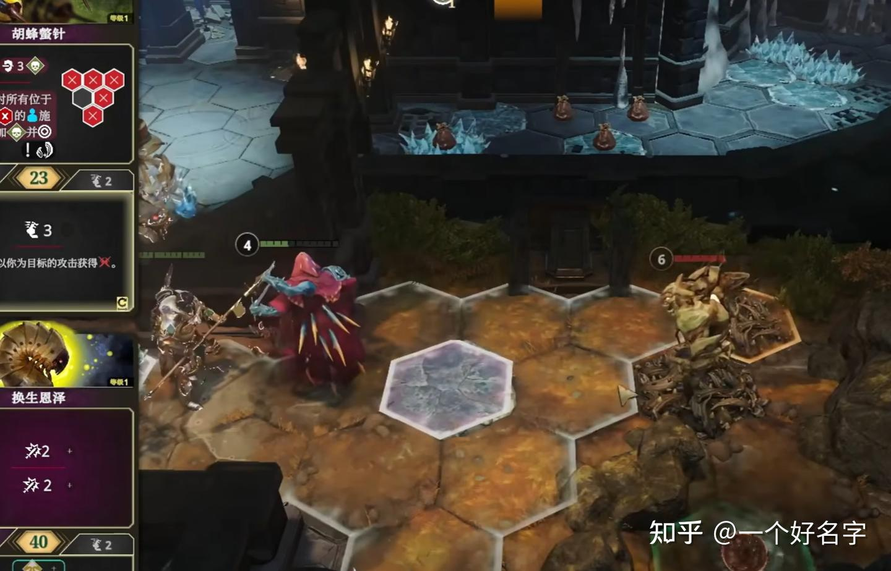  

霜港迷城游戏截图，图源https://www.bilibili.com/video/BV1H4thzVEHY

  
  
  
  
我们将深入解析如何使用 **Unity Shader Graph** 复刻这一效果。由于节点连接较为复杂，我们将整个逻辑拆解为三个核心模块进行讲解。  
  
后续的shader graph截图可能看不太清，完整节点可以访问我的仓库

[霜港迷城六边形高亮复刻shader仓库](https://github.com/Kiameow/ShaderCollection)

---

### 第零部分：资源准备  
一个经过UV编辑的六边形片面 (正方形片面也可以，不需要UV编辑但是shader表现方面需要额外步骤)

具体如何进行UV编辑在第1部分内展开

### 第一部分：基于 SDF 的六边形边缘绘制  
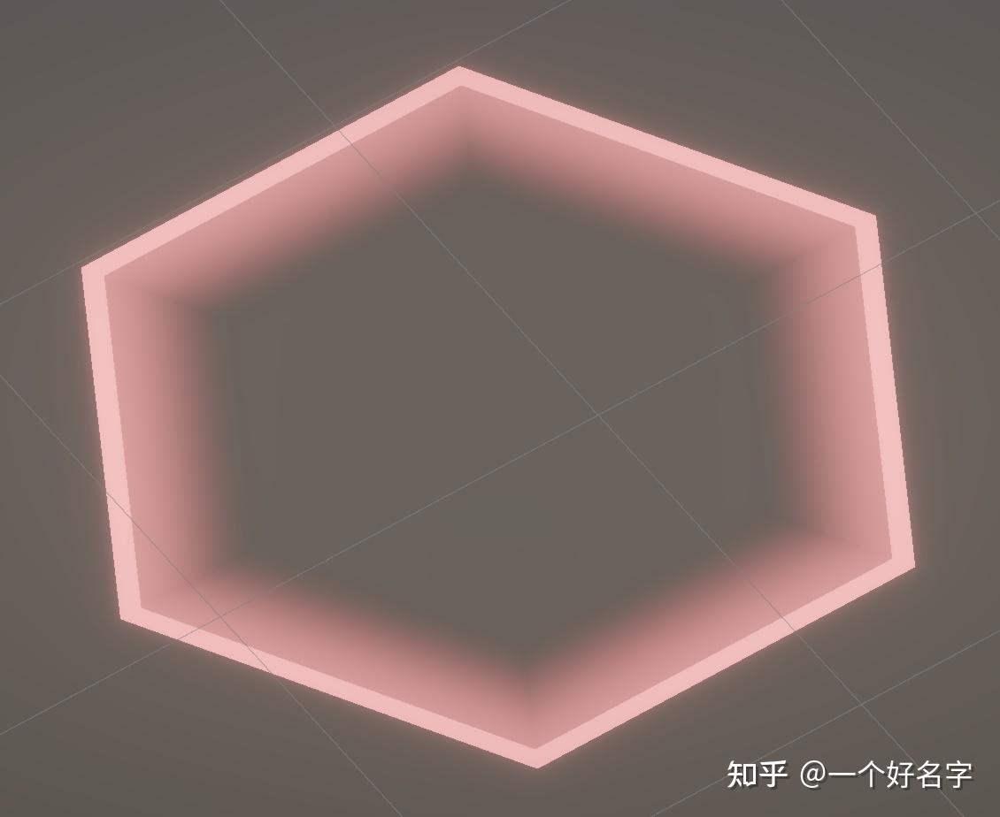  
  
为了获得最大的表现控制以及不失真，我们在物体的UV坐标上使用SDF来绘制六边形边缘，为了适配后续的shader代码，你需要把六边形片面的UV展开为如下所示：

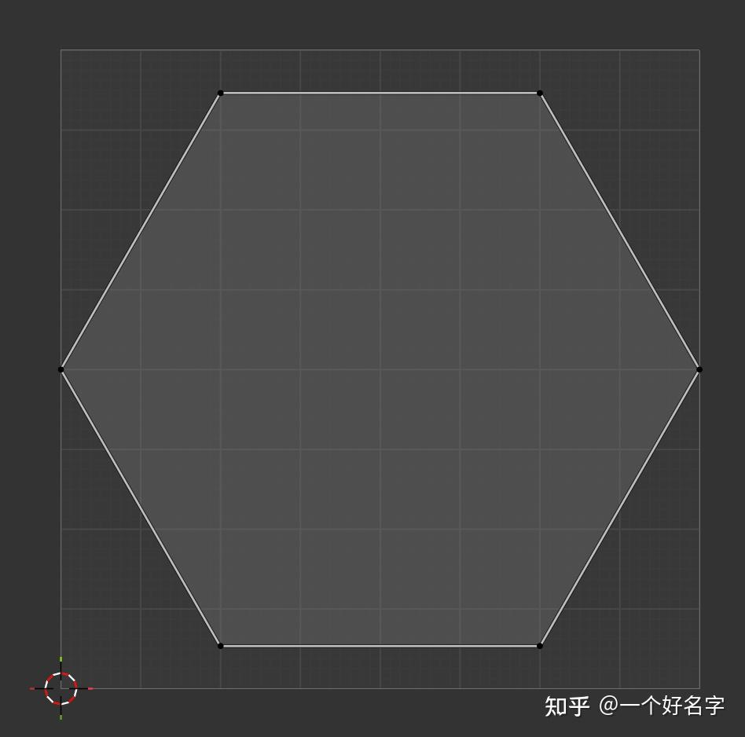  

左下方为（0，0），顶部是平边，横向的顶点与左右两边相交

  
  
  
第一部分的shader逻辑为：  
1. **UV 重映射**：首先将 UV 坐标从 `[0, 1]` 减去 `0.5`，使其中心点变为 `(0, 0)`。  
2. **镜像对称**：使用 `Absolute` 节点处理 X 和 Y，这样我们需要计算的象限就减少了。  
3. **六边形SDF** 则可以参考下列文章的推导办法，这里简单说明一下大致的过程。

[2D平面基本图形SDF推导01](https://zhuanlan.zhihu.com/p/420700051)  

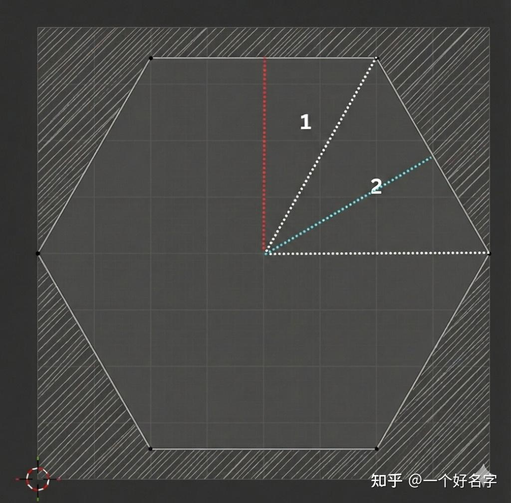  
之前坐标做了绝对值，因此只剩下了第一象限的点需要考虑，显然这个区域可以划分为两部分。

对于图中区域1，红线的长度既是我们平常理解的边界点与中心点之间的距离，也是边界点与中心点的sdf结果，为了方便描述，我们把这种线叫做基准轴。因此可以把区域1中的点统统投影（点乘）到这条红色基准轴上，化简后得到区域1的上边界sdf为y。

对于图中区域2，蓝线为基准轴，将区域2中的点投影至基准轴上，基准轴的方向向量为 `(根号三/2， 1/2)`， 故最终的sdf为 `∣x∣⋅0.866+∣y∣⋅0.5` (根号三/2为0.886)。

最后我们需要把两个基准线划定的区域做交集，假设六边形外径为0.5，我们把最终sdf返回值小于0.5的区域填上白色以标识六边形，那么我们观察区域1上方的阴影部分，它在蓝色基准线下的sdf小于0.5，在红色基准线下的sdf大于0.5，而这块区域实际上不应该被填充白色，因此应当取两个基准线下sdf较大的值作为最终的sdf，即 `sdf = max(|y|, ∣x∣⋅0.866+∣y∣⋅0.5)` 

由于六边形UV坐标外径为0.5，故最后sdf == 0.5的点即为边界点。

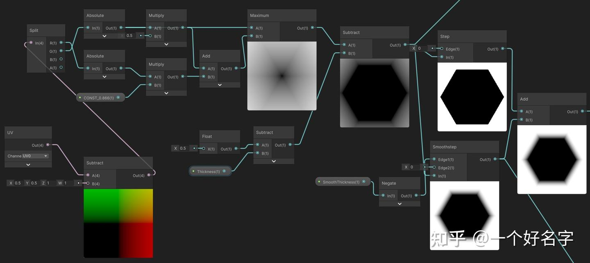  

第一部分节点展示，硬边缘厚度和过渡边缘厚度开放为了参数，方便调整

  
  
4. 使用step获得硬边缘，使用smoothstep获得过渡边缘，相加后得到第一部分最终效果  
  

---

  

### 第二部分：极坐标与无缝径向烟雾  
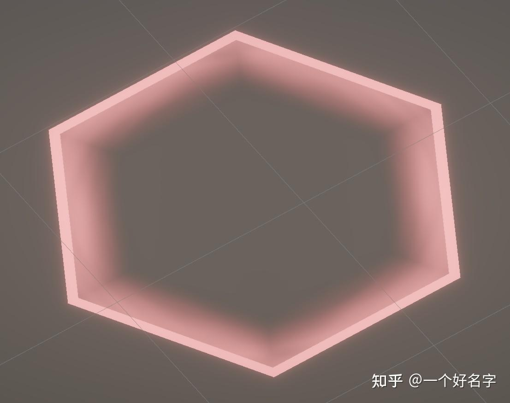  

第二部分效果产出

  
  
让噪声平移采样的逻辑很常见也很简单，只需要加一个方向速度乘上时间节点的xy偏移即可，而要实现径向移动采样，则可以考虑把(x, y)变为(r, θ)，径向变化只需要改变r的大小就可以了。

  
**实现思路：**  
1. **极坐标转换**：使用 `Polar Coordinates`节点将 UV 转换为（r，θ）格式。  
2. **动态噪声**：将 `Time`节点连接到噪声的 Offset 或 UV 的输入上，让烟雾动起来。  

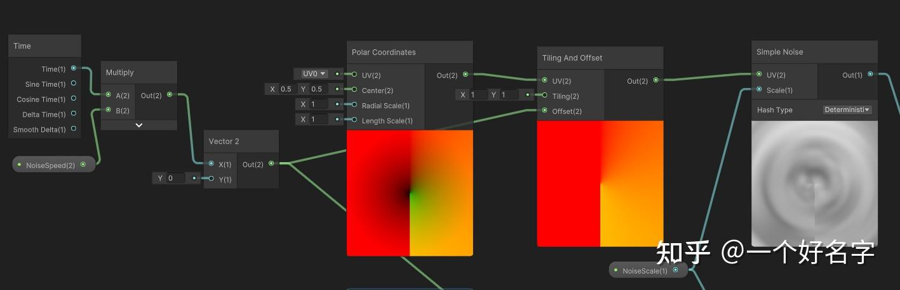  
可以看到极坐标UV在中间下方有明显的接缝。为了解决这个问题，我们可以复制上面的流程，并旋转180度，获得一张上方有接缝的极坐标UV，之后选取第一张的上面部分，选取第二张的下面部分重新缝合（这里重新整了个smoothstep来获得过渡丝滑的插值）即可解决。

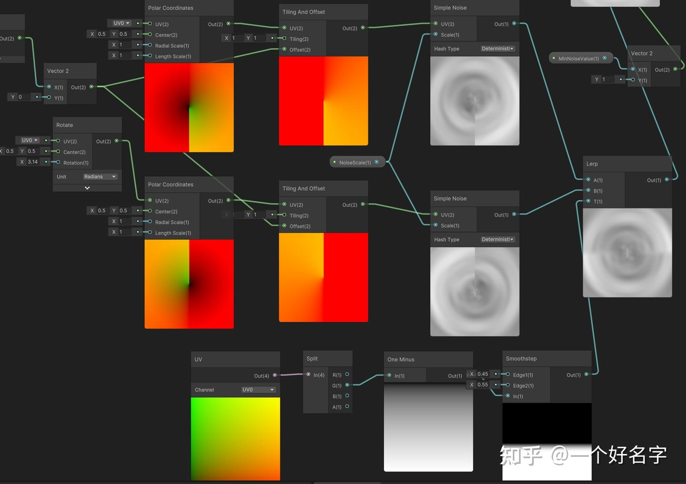  

第二部分节点展示

  
  
将第二部分与第一部分产出相乘即可获得烟气径向变化的效果。  
  

---

  

### 第三部分：智能连通性与边缘遮罩 (Edge Mask)  
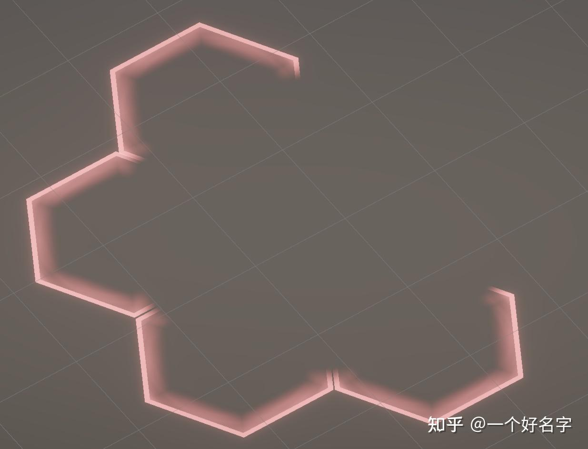  

第三部分效果产出

  
  
  

在霜港迷城中，当两个格子相邻时，它们中间的边需要隐藏，以形成连通的区域感。显然单独作用于一个片面的shader无法得知相邻片面的情况，我们可以将相邻判断的逻辑处理放在脚本中，而shader只接受一个EdgeMask（0-63）来控制六边形 6 条边的显示与隐藏。

关于EdgeMask，可以举个例子，我们把六边形的六条边配置不同的权重，分别为1，2，4，8，16，32，那么当EdgeMask为17时，对应的二进制即为010 001，则权重为1和权重为16的边显示，其余隐藏。  
  
1. **扇区划分**：利用 `Arctangent2` 接受来自偏移UV坐标的值来获得对应的角度。通过整除来将 360 度分割为 6 个扇区（0 到 5）。这里可以看出如果使用尖顶在上的UV展开，进行扇区划分会非常痛苦。

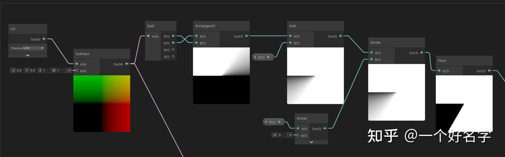  

PI是3.14，加一个PI是为了让原来的[-PI, PI] 变为 [0, 2\* PI]，除以PI/3并Floor后变为[0, 5]

  
  
2. **位运算模拟**：我们根据当前像素所属的扇区 ID，去“读取” `_EdgeMask` 中对应的二进制位是 0 还是 1。节点逻辑为`Floor(_EdgeMask / Pow(2, SectorID)) % 2` 

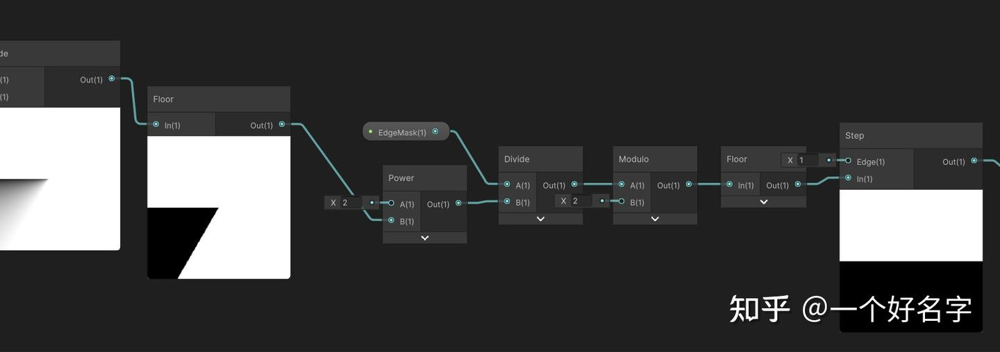  

这里的EdgeMask为56, 即为32 + 16 + 8，正好为上方的连续的三条边

  
  
但是仅仅这样的话，格子与格子的连接部分会相当生硬

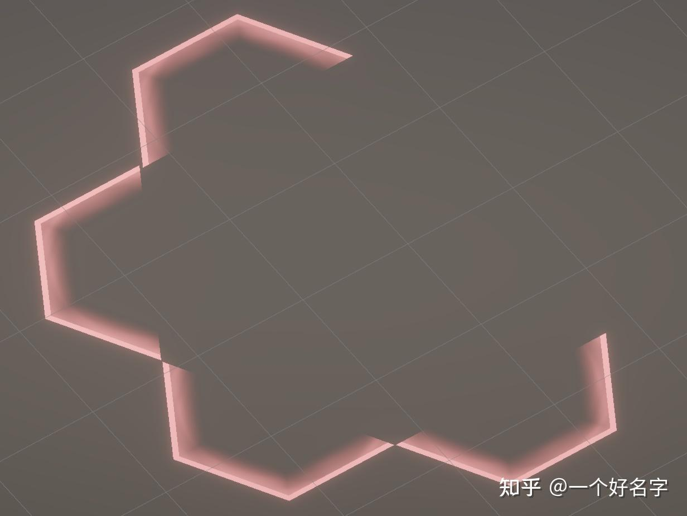  
  
3. 为了让**边缘平滑过渡**，首先我们需要通过获取“相邻扇区”的显示状态来决定是否添加过渡，并进行 `Lerp` 的逻辑。而具体如何插值，我们可以注意到扇区划分时还未舍去小数时的小数部分变化情况，其实就已经很符合我们要的过渡效果了（即根据到扇区交界处的角度差来进行插值）。

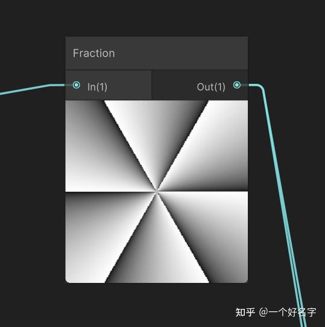  
注意图示中每个扇区都是单向逆时针从小变大，我们拿最上方的扇区举例，针对左方的过渡情况，直接把左边显示情况 (0隐藏，1显示) 作为上界，0为下界，拿小数部分lerp即可；针对右方的过渡情况，则需要把右边显示情况**作为下界**，0为上界，拿小数部分lerp。  
  

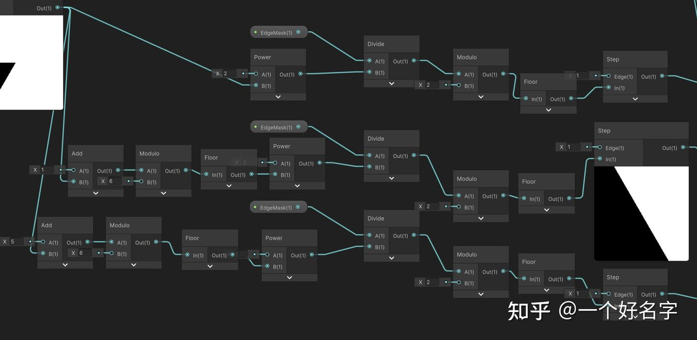  

拿之前的扇区Floor结果分别加减1下标，来获取相邻扇区的情况，注意涉及扇区的每次除法后都要取一次Floor以免因为精度出现问题

  
  
  

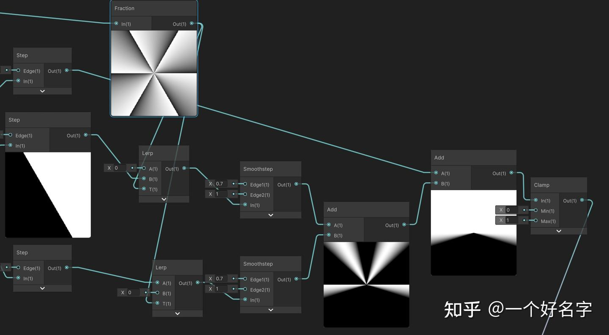  

使用小数部分对3个结果进行lerp，注意lerp的上下界

  
  
  

---

  
  
最后把三个部分的结果乘在一起，再乘上一个Color节点就大功告成啦！

