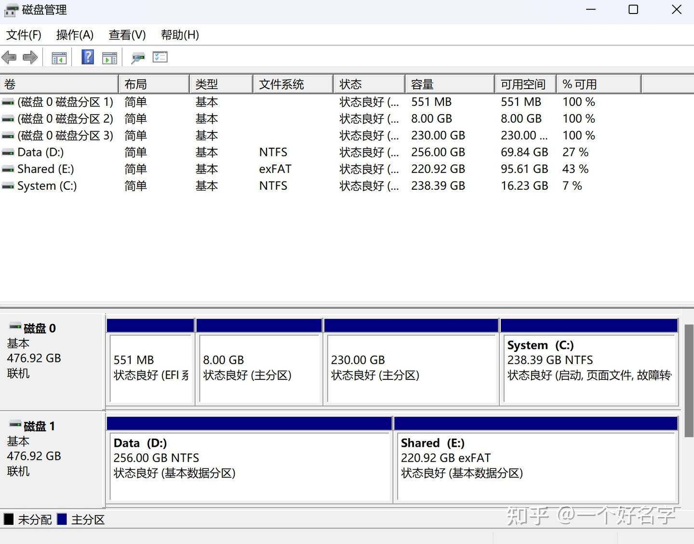
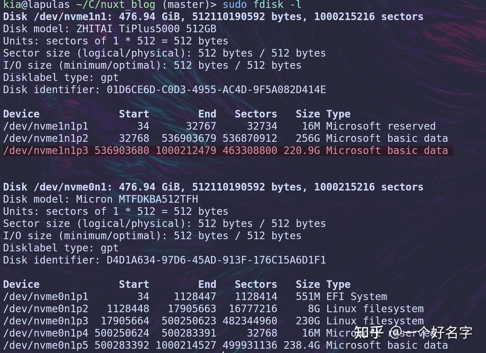
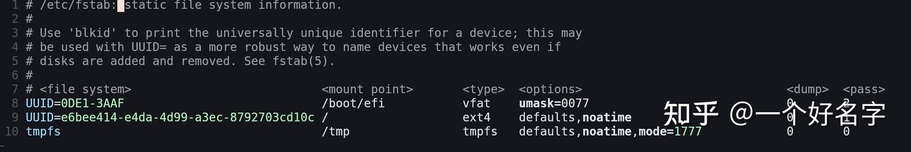
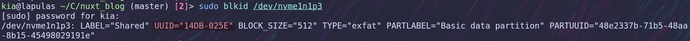
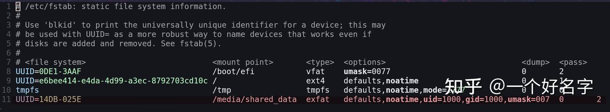

## 磁盘格式的选取  
NTFS是Windows下最常见的分区格式，而Linux对其的支持已经很完善了，只要是内核版本大于等于5.15的发行版都是无痛兼容的（[https://docs.kernel.org/5.15/filesystems/ntfs.html](https://docs.kernel.org/5.15/filesystems/ntfs.html)），5.15之前的也有对ntfs的基本支持，但并不完善，需要额外安装ntfs-3g。

exFAT作为一种服务于便携性的磁盘格式，兼容性更为广泛，所有版本的Windows，现代版本的MacOS和内核版本大于等于5.7的Linux发行版都是适用的。

两者都可以作为共享分区的磁盘格式。

## 先Windows还是Linux？  
  
那么在顺序上呢，显然有两种选择：  
1. 在Windows下新建卷，格式化为 exfat / ntfs，再到Linux下挂载该分区。  
2. 在Linux下新建格式为 exfat / ntfs的分区，然后直接切换到Windows更新磁盘分区。  
  
但是第二种方案在个人测试后，出现了Windows无法识别出新分区的情况，不确定这是否是概率事件。  
  
相比较来讲，第一种方案可行性更高，因为Linux的兼容性更好，能够更好配合来自Windows对磁盘分区的更新。如果你有Linux分区挂载的经验，那基本上不会遇见什么问题，就可以退出这篇文章了，如果你不太明白，可以继续往下看详细步骤。(个人选取的是exfat格式，关于ntfs，步骤是一样的，替换格式即可)  


## 详细步骤  
### 1. 在Windows下新建卷，格式化为exfat  
  
打开**磁盘管理**，你可以看到机子上的所有硬盘，以及分区情况。

1. 如果你没有空闲分区，就选择你想要改为共享分区的那块，右击选择删除卷。
2. 准备好空闲分区后，再右击选择新建卷，在其中选择你要划分的大小以及格式（**exfat**），如果划分的大小小于空闲分区，那么就会把剩余的作为新的空闲分区。
3. 划分好区域后，记得**记下新划分分区的大小**或将磁盘总览页面拍照记录，后续会用于在Linux中定位新分区。

  


Windows磁盘管理界面，Shared为新建的共享分区

  
  
### 2. 在Linux中定位分区设备  
切换到Linux，首先我们需要查看新的分区具体是Linux中的哪个设备文件  


```
sudo fdisk -l
```
  
fdisk -l 命令可以展示本机当中的所有硬盘以及其中的分区信息，并且还会附上如磁盘型号，单元大小，label类型

  


fsdisk命令结果

  
  
  
可以看到上面的命令结果，根据之前在Windows下记录的磁盘总览，判断 /dev/nvme1n1p3 就是新的共享分区。  
  


### 3. 在Linux中挂载新分区  
查找到了具体的设备文件后，我们还需要将该设备文件映射到Linux文件系统的某个目录中，这个过程也被称为挂载，有了挂载点，我们才能在Linux文件系统中访问磁盘分区内容。  
  
这里我们采用的挂载方法是编辑 **/etc/fstab** 文件（用于自动管理系统分区的挂载点，每次系统启动时都会调用它。由于其声明式的特点十分方便易用，新增挂载只需新增一条记录即可。）

  


fstab文件内容

  
  
  
可以看到fstab中有6列信息，让我分别解释：

* uuid： 分区的标识符
* mount point： 挂载目录点
* type： 分区类型
* options： 挂载选项 （后面会具体展开）
* dump： 备份选项（0为不备份，1为每天备份，2为不定期备份）
* pass： 文件系统检查顺序，通常根目录设为1（首先检查），其他分区设为2（其次检查），特殊分区如swap设为0（不检查）

要获取我们新分区的uuid，可以使用 **blkid** 命令  


```
sudo blkid 分区名
```
  


blkid获取uuid

  
  
  
**mount point** 是自定义的，一般来说，共享分区挂载在 **/media** 目录下，我选择在`media`目录下新建一个文件夹`shared\_data`作为挂载点。  
  
**type** 则是 **exfat**  
  
**options** 的详细内容可以参见 *[https://man.archlinux.org/man/mount.8#FILESYSTEM-INDEPENDENT\_MOUNT\_OPTIONS](https://man.archlinux.org/man/mount.8#FILESYSTEM-INDEPENDENT\_MOUNT\_OPTIONS)*，这里只说几个比较常见的选项：

* defaults： 包含了最常用的一些挂载选项
* noatime： 不更新文件访问时间，可以加快磁盘访问速度
* umask： 权限遮罩，目录的最大权限是777,如果umask设为007，则目录权限变为（777-007）=770,即所有者和所属组拥有完整权限，而其他用户没有权限
* uid,gid： 设置挂载点所有者和所属组，为了让我们的Linux用户可以方便地访问共享分区，可以将uid和gid设成用户和用户组。系统保留的uid和gid是0-999,因此我们登入的用户一般是uid为1000,gid也为1000

  
  
有了以上信息，我们可以向fstab写入以下记录：


```
UUID=14DB-025E /media/shared_data exfat defaults,noatime,uid=1000,gid=1000,umask=007 0 2
```
  


编辑后的fstab文件内容，标红为新增内容

  
  
  
在写好fstab后，使用 **mount -a** 即可通知系统对硬盘分区重新根据fstab挂载，有的时候会要求你更新一下系统的状态，因为系统可能还在使用旧版本的fstab, systemctl daemon-reload可以帮你重新加载系统。  
  
挂载好后，查看是否能够正常访问挂载点，一般来讲目录里会有Windows分区后留下的RECYCLE和VolumeInfo文件

  


查看挂载点目录

  
  
  
结束！

